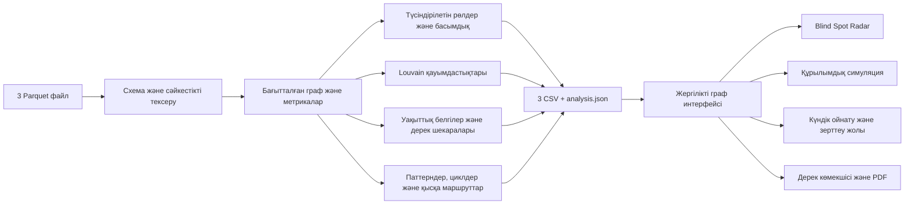

# AQSHA TRACE

**Бір аударымнан — қаржы желісінің түсіндірілетін моделіне.**

HackAlem / Freedom кейсіне арналған жергілікті AML зерттеу құралы. Үш Parquet файлын оқиды, барлық түйінді рөлдерге бөледі, қауымдастықтарды анықтайды, тексеру басымдығын есептейді және интерактивті граф ашады. Рөлдер — **тексерілетін гипотезалар**. Рөл скоры ереженің орындалу күшін білдіреді; ол кінәлілік ықтималдығы немесе өлшенген модель дәлдігі емес.

Ұйымдастырушылар берген нақты датасет тексерілді: **2 248 түйін, 3 119 байланыс, 4 840 транзакция, 81 бастапқы шот**. Жергілікті көшірме `data/challenge/` ішінде; ол Git-ке қосылмайды. `--demo` режимі бөлек **синтетикалық** дерек жасайды; демо сандары ресми датасеттің нәтижелері ретінде ұсынылмайды.

## Іске қосу

Python **3.12** және заманауи браузер қажет. GPU, дерекқор, Node.js, API кілті немесе ақылы қызмет қажет емес. Кітапханалар орнатылған соң бүкіл жүйе интернетсіз жұмыс істейді.

Бір реттік орнату (Windows PowerShell):

```powershell
py -3.12 -m venv .venv
.\.venv\Scripts\python -m pip install -r requirements.txt
```

**Нақты датасет + пайплайн + сайт, бір команда:**

```powershell
.\.venv\Scripts\python run.py --data data/challenge --output output/challenge --serve
```

Браузер: **http://127.0.0.1:8765**. Портты `--port 8767` арқылы өзгертуге болады (8766 — жергілікті модель порты). Серверді тоқтату: `Ctrl+C`.

Осы компьютердегі дайын ортаны қайта ашудың қысқа жолы: `./start.ps1`. Ол жоба виртуалды ортасын, қолжетімді Python-ды немесе орнатылған Codex Python ортасын табады. `data/challenge/` ішінде үш файл болса, аргументсіз сол нақты деректі ашады; болмаса, демоны іске қосады. Синтетикалық мысал үшін: `./start.ps1 --demo --serve`.

Linux/macOS:

```sh
python3.12 -m venv .venv
.venv/bin/python -m pip install -r requirements.txt
.venv/bin/python run.py --data data/challenge --output output/challenge --serve
```

Нақты деректі толық қайта есептеу (қолмен аралық қадамдарсыз):

```powershell
.\.venv\Scripts\python run.py --data data/challenge --output output/challenge
```

Сол дерекпен сайт ашу үшін соңына `--serve` қосыңыз. Немесе жұмыс істеп тұрған сайттағы жүктеу терезесінен үш Parquet файлын бірге таңдаңыз. Файлдар тек жергілікті серверге жіберіледі. Әр файлға 24 MiB, JSON сұрауына 64 MiB шегі қойылған; бұл кейстің көлеміне жеткілікті. Жүктелген дерек `data/uploads/` ішінде, оның нәтижелері `output/runs/` ішінде сақталады. Бұл қалталар Git-ке қосылмайды. Сәтсіз талдау алдыңғы жұмыс нәтижесін ауыстырмайды.

## Кіріс пен шығыс

Жаңа компьютерде ұйымдастырушылардың `data (1).zip` архивіндегі `data/` бумасынан үш Parquet файлын `data/challenge/` ішіне салыңыз. Архивтің `__MACOSX/` қызметтік файлдары қажет емес. Starter бастапқы кодын орындау қажет емес: ол схема мен талаптарды салыстыру үшін оқылды; біздің пайплайн толық іске асырылған.

Кіріс каталогында дәл осы үш файл болуы керек:

| Файл | Міндетті бағандар |
|---|---|
| `nodes.parquet` | `gid`, `depth`, `is_seed` |
| `edges.parquet` | `src`, `dst`, `sum_kzt`, `n_tx`, `depth` |
| `transactions.parquet` | `src`, `dst`, `date`, `sum_kzt` |

`gid`, `src`, `dst` — int64 идентификаторлары; `depth` — 0–4; сомалар — оң, ақырлы KZT мәндері. `is_seed` — boolean. Даталар UTC-ге келтіріліп күн бойынша талданады. Барлық шот, оның ішінде байланыссыз seed те сақталады. Қате схема, белгісіз түйінге сілтеме, дұрыс емес сомалар немесе транзакциялар мен агрегатталған қабырғалардың сәйкес келмеуі түсінікті қате береді.

Нәтижелер:

| Файл | Бағандар |
|---|---|
| `nodes_roles.csv` | `gid, role, role_score, cluster_id, priority_score, evidence` |
| `clusters.csv` | `cluster_id, n_nodes, n_seed, sum_kzt_internal, top_gids, hypothesis` |
| `top_nodes.csv` | `rank, gid, role, priority_score, why` |
| `analysis.json` | Интерфейс үшін метрикалар, граф, шектеулер, уақыттық қатар, негіздемелер |

CSV UTF-8 форматында жазылады. `evidence` бос емес және 200 таңбадан аспайды. Топ-тізімде кемінде 20 түйін бар (20-дан аз түйіні бар дерек үшін барлығы шығарылады). Қолданыстағы нәтижелерді сайттан жүктеуге болады.

## Қосымша идеялар

**Blind Spot Radar / Ақ дақтар.** Төртінші буындағы шекара, толық емес seed кірісі, көрінетін кірістен артық шығыс және байланыссыз бастапқы шоттар бөлек көрсетіледі. Әр түйін үшін келесі дерек сұрауы ұсынылады. Бұл қорытынды қай жерде сенімсіз екенін бірден түсіндіреді.

**Желі тұрақтылығы симуляциясы.** Таңдалған түйіндерді графтан шартты алып тастап, компоненттер санын, ең үлкен компонентті және seed-тен қолжетімділікті салыстырады. Бұл нақты шотты бұғаттамайды, ақшаның тоқтауын немесе топтың бейімделуін болжай алмайды. «Қолжетімсіз болған» саны жойылмаған, бірақ seed-тен жолы үзілген түйіндерге қатысты.

**TOP-N салыстыру.** Рейтингтегі алғашқы 1, 3, 5, 10 немесе 20 шотты алып тастау сценарийі. Қисық әр қосымша шотты алып тастағаннан кейінгі нәтижені көрсетеді; бастапқы желі сақталады.

**Түсіндірілетін карточка.** Кіріс/шығыс сомалары, контрагенттер саны, орталықтық, уақыттық белгілер, рөл негіздемесі және келесі сұрау бір жерде. GID арқылы іздеу нақты шоттың байланыстарын ашады; рөл, кластер және буын бойынша сүзуге болады.

**Паттерндер.** Белсенділіктің күрт өсуі, бір күндегі көп жіберуші, жылдам қайта аударуға сәйкес күндік көлемдер, ұқсас сомаларға бөлу және сол буындағы шоттардан ауытқу анықталады. Қайталанатын қысқа маршруттар мен бағытталған циклдер жеке көрсетіледі. Әр белгіде қатысқан GID, сандар және ереже бар; оны графтан ашуға болады. Іздеу ұзындығы мен саны шектеледі және шекке жеткені көрсетіледі. Бұл белгілер заңсыздықты немесе бір ақшаның нақты жүріп өткен жолын дәлелдемейді.

**Уақыт бойынша граф.** Күнді таңдап, сол күнгі немесе сол күнге дейінгі аударымдарды қараңыз. Ойнату күндерді ретімен ауыстырады; нақты сағат/минут реті туралы болжам жасалмайды. Рөлдер мен басымдық рейтингі толық кезең бойынша есептелген күйде қалады. Толық граф режимі барлық шотты көрсетуге мүмкіндік береді.

**Дерекке сүйенетін көмекші.** Екі режим бар: жылдам ережелік жауап және компьютердегі Qwen3 тілдік моделі. Модельге қазіргі графтан төрт шотқа дейінгі шағын дерек үзіндісі беріледі. Жауаптағы сілтемелер нақты карточканы ашады. Аты-жөн мен кінәлілік туралы сұрақтарға дерек шегін тексеретін ереже жауап береді. Модель мәтіні қателесуі мүмкін; сілтеме сәйкестігін тексеру барлық тұжырымның дұрыстығын дәлелдемейді.

Модель деректе жоқ сан ұсынса, жауап ережелік режиммен қайта құралып, бұл ауысу белгіленеді. Жауапты аналитик бастапқы көрсеткіштермен салыстырады.

**PDF зерттеу есебі.** Жалпы шолу немесе жеке шот карточкасын қазақ әріптері сақталған PDF ретінде жүктеңіз: бақыланған көрсеткіштер, рөл негіздемесі, табылған белгілер, келесі дерек сұрауы және қорытынды шектеулері бірге беріледі. Есеп заңдық айыптау емес, аналитиктің тексеру материалы.

**Тексеру зертханасы.** Қосымша ақпарат келгендегі жұмыс бір бөлімде:

- Шотқа тексеру мәртебесін, сарапшыны, құжатқа сілтемені, қысқаша дәлелді және тексерілген рөлді тіркеу. Өзгерістер тарихы сақталады. Құжаттың өзін автоматты растау немесе аты-жөнді іздеу жүргізілмейді.
- Рөлдерге арналған CSV үлгісін жүктеу, сарапшы белгілерін CSV/JSON арқылы импорттау; accuracy, precision, recall, F1 және қате матрицасын есептеу. Белгі жоқ кезде нәтиже бос болады. Метрикалар тек берілген ішкі жиынға қатысты, тәуелсіз тест дәлдігі емес.
- Қосымша аударымдарды JSON арқылы бөлек кеңейтілген графқа қосу. Міндетті өрістер: `src,dst,date,sum_kzt,source_reference,transaction_id`; ұзын GID-тер тырнақшадағы жол болуы тиіс. Деректің бастапқы үзіндімен қайталанбайтынын пайдаланушы растайды. Бір дереккөздің бірдей transaction_id-і қайта саналмайды, қайшы жазба қабылданбайды. Жаңа шотқа рөл ойдан тағайындалмайды; бастапқы рөлдер бастапқы дерекке қатысты болып қалады.
- Таңдалған шоттан 12 байланысқа дейін жолдар мен циклдерді іздеу, жұмыс лимиті біткенде жалғастыру; екі шот арасындағы ең қысқа бағытталған жолды ұзындық шегінсіз табу. Бұл қолдағы графты зерттейді, берілмеген аударымды қалпына келтірмейді.
- «Байланыстардың белгілі бөлігі қайта құрылса ше?» сценарийін 0–100% аралығында салыстыру. Жасанды алмастырушы түйіндер мен жорамалдар ашық көрсетіледі; болашақты болжау ретінде ұсынылмайды.

Журнал мен кеңейтілген граф `data/investigations/` ішінде кіріс деректің SHA-256 ізіне байланыстырылып сақталады. Серверді қайта ашқанда сақталады; басқа датасетпен араласпайды. Бастапқы үш CSV өзгермейді.

## Жергілікті тілдік модель

Осы компьютерге [Qwen3-1.7B-GGUF](https://huggingface.co/Qwen/Qwen3-1.7B-GGUF) Q8_0 және [llama.cpp](https://github.com/ggml-org/llama.cpp) CPU сервері орнатылған. Модель файлы шамамен 1,83 GB; `.local/` қалтасы Git-ке қосылмайды. Жаңа Windows x64 компьютерінде бір рет:

```powershell
.\.venv\Scripts\python scripts/install_local_model.py
./start-local-model.ps1
```

Орнатқыш ресми файлдарды бекітілген нұсқа мен SHA-256 бойынша тексереді. Алғашқы жүктеуге интернет керек; жауап беру кезінде желілік қызметке дерек жіберілмейді. `./start.ps1` орнатылған модельді сайтпен бірге іске қосады. Модельді бөлек терминалда басқару үшін `./start-local-model.ps1 -Foreground` қолданыңыз; `Ctrl+C` оны тоқтатады. Көмекші панелінен «Жергілікті модель» таңдаңыз. CPU жауабы бірнеше ондаған секунд алуы мүмкін.

Модель тек `127.0.0.1:8766` адресінде, автоматты жасалған жергілікті кілтпен жұмыс істейді. Бұл ақылы API кілті емес. Негізгі пайплайн мен ережелік көмекші модельсіз де жұмыс істейді. Автоматты LLM орнатқышы Windows x64 үшін; Linux/macOS негізгі пайплайнына модель міндетті емес.

## Әдіс және шектеулер

Барлық рөлдерге арналған формулалар, шектер, басымдық салмақтары және есептеу тәртібі [docs/METHODOLOGY.md](docs/METHODOLOGY.md) ішінде. Алдын ала белгіленген «дұрыс» GID тізімі жоқ. Бірдей дерек бірдей рөл, рейтинг және кластер береді.

Жергілікті API мен JSON құрылымы: [docs/API.md](docs/API.md).

Кейс талаптары, қосылған мүмкіндіктер және дерекпен ғана шешілмейтін тұстар: [docs/CASE_COVERAGE.md](docs/CASE_COVERAGE.md).

- **Depth=4 және out_degree=0** соңғы алушы екеніне жеткіліксіз: бұл бақылаудың шекарасы болуы мүмкін.
- Тек көрінетін ағын есептеледі. Кіріс пен шығыс айырмасы банк шотының нақты қалдығы емес.
- Seed үшін кіріс толық емес, сондықтан шығыс/кіріс қатынасы рөлге сенімді дәлел ретінде пайдаланылмайды.
- 5 000 KZT-ден төмен транзакциялар, банктен тыс аударымдар және берілген кезеңнен тыс әрекеттер туралы қорытынды жасалмайды.
- Уақыттық жақындық дәл сол ақшаның әрі қарай кеткенін дәлелдемейді.
- Қауымдастық бір қылмыстық ұйым екенінің дәлелі емес. Louvain — құрылымдық топтау.
- Ground truth жоқ: accuracy мәлімделмейді. Бағалау — түсіндірмелілік, тұрақтылық, артефактілерді ескеру және қайта іске қосылу.
- Сыртқы дерекпен байыту, аты-жөн, ЖСН, жыныс, табыс немесе клиент сипаттарын ойдан қосу жоқ.

## Шешім схемасы



## 5 минуттық демо

1. **0:00–0:40:** `--demo --serve` командасын іске қосу, синтетикалық дерек екенін айту, үш CSV-ді көрсету.
2. **0:40–1:25:** рейтингтегі бірінші шотты ашып, рөл негіздемесін, ұпай үлестерін және келесі дерек сұрауын көрсету.
3. **1:25–2:15:** Паттерндерден қайталанатын маршрутты ашу; графта жолын белгілеу, күндік ойнатуды қосу. Бір ақшаның ізі дәлелденбегенін түсіндіру.
4. **2:15–3:00:** TOP-5 симуляциясын іске қосу; әр қадамда seed-тен қолжетімділік қалай өзгеретінін көрсету.
5. **3:00–3:45:** көмекшіге «Кімді бірінші тексеру керек?» деп сұрап, жауаптағы нақты шот сілтемесін ашу.
6. **3:45–4:20:** Ақ дақтардан depth=4 шекарасын және қосымша сұратылатын деректі көрсету.
7. **4:20–5:00:** шоттың PDF есебін жүктеу; модель рөлдері тексеру гипотезасы екенін және нақты дерекке ауысу жолын айту.

## Тексеру

```powershell
.\.venv\Scripts\python -m pip install -r requirements-dev.txt
.\.venv\Scripts\python -m unittest discover -s tests -v
```

Тесттер CSV/JSON келісімін, барлық түйіндердің сақталуын, рөл шекараларын, толық емес қатынастарды, детерминизмді, кластер айналымын, қате кірісті және симуляциядағы нақты бағытталған қолжетімділікті тексереді.

Тексеру нәтижелері мен синтетикалық көлемдік өлшеу: [docs/VALIDATION.md](docs/VALIDATION.md). Репозиторийдегі дайын CSV мысалдары: [examples/demo-output](examples/demo-output/README.md).

Тәуелділіктерді жаңадан орнатып, `.deps` пен дайын ортаға сүйенбей тексеру:

```powershell
python scripts/verify_clean.py --data data/challenge
```

Бұл команда `.build-temp/` ішінде жеке виртуалды орта мен бастапқы код көшірмесін жасайды, кітапханаларды орнатады, тесттерді және толық пайплайнды орындайды. Алғашқы орнатуға интернет қажет. `verification.json` ішінде толық CLI уақыты мен тексерілген орта, `installed.txt` ішінде кітапхана нұсқалары сақталады. Бұл сол компьютердегі оқшауланған орта сынағы; бөлек жаңа операциялық жүйеде тексерумен тең емес. Нақты дерексіз тексеру үшін `--data` аргументін алып тастаңыз.

`.github/workflows/verify.yml` Windows, Ubuntu және macOS үшін тест пен демо пайплайнды іске қосуға дайын. Осы жергілікті жұмыста қашықтағы CI орындалған жоқ; оның нәтижесін GitHub Actions іске қосылғаннан кейін тексеру керек.

## 1 млн түйінге дейін масштабтау

Қазіргі шешім кейстегі бірнеше мың түйінге арналған. Миллион түйінде NetworkX объектілерін түгел RAM-да ұстау мен толық графты браузерге жіберу өзгертіледі:

- Parquet сканын DuckDB/Polars арқылы бағандық, ағындық агрегаттауға ауыстыру; түйіндер мен қабырғаларды бөлімдерге бөлу.
- Метрикаларды CSR/CSC массивтерінде igraph/graph-tool сияқты ықшам қозғалтқышпен есептеу. Betweenness үшін таңдама, PageRank үшін итерациялық есеп және уақыт лимиті.
- Қауымдастықтарды иерархиялық есептеп, интерфейске кластерлердің жиынтық графын беру; нақты көршілерді серверден сұраныспен жүктеу.
- Толық қайта есептеуді batch-job ретінде орындап, кіріс нұсқасы мен алгоритм параметрлерін тіркеу; өзгермеген бөлімдерді қайта қолдану.
- Үлкен желіде бес минут орындалатыны туралы уәде жоқ: жад пен кідіріс өлшеніп, бөлек мақсат қойылады.

## Құрылым

```text
moneygraph/       CLI, пайплайн, демодерек, жергілікті HTTP API
web/              HTML/CSS/JavaScript интерфейсі, сыртқы CDN жоқ
tests/            Қайта орындалатын тексерулер
docs/             Формулалар және әдістің негіздемесі
data/             Кірістер (Git-ке қосылмайтын demo/uploads)
output/           Генерацияланған нәтижелер (Git-ке қосылмайды)
```

HTTP сервер тек `127.0.0.1` адресіне байланады және сайттың жария хостингіне арналмаған. Дерек пайдаланушының компьютерінен шықпайды.
