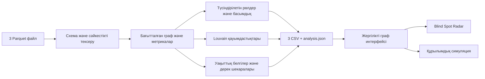

# AQSHA TRACE

**Бір аударымнан — қаржы желісінің түсіндірілетін моделіне.**

HackAlem / Freedom кейсіне арналған жергілікті AML зерттеу құралы. Үш Parquet файлын оқиды, барлық түйінді рөлдерге бөледі, қауымдастықтарды анықтайды, тексеру басымдығын есептейді және интерактивті граф ашады. Рөлдер — **тексерілетін гипотезалар**. Рөл скоры ереженің орындалу күшін білдіреді; ол кінәлілік ықтималдығы немесе өлшенген модель дәлдігі емес.

Ұйымдастырушылар берген нақты датасет тексерілді: **2 248 түйін, 3 119 байланыс, 4 840 транзакция, 81 бастапқы шот**. Жергілікті көшірме `data/challenge/` ішінде; ол Git-ке қосылмайды. `--demo` режимі бөлек **синтетикалық** дерек жасайды; демо сандары ресми датасеттің нәтижелері ретінде ұсынылмайды.

## Іске қосу

Python **3.12** және заманауи браузер қажет. GPU, дерекқор, Node.js, API кілті немесе ақылы қызмет қажет емес. Кітапханалар орнатылған соң бүкіл жүйе интернетсіз жұмыс істейді.

Бір реттік орнату (Windows PowerShell):

```powershell
py -3.12 -m venv .venv
.\.venv\Scripts\python -m pip install -r requirements.txt
```

**Нақты датасет + пайплайн + сайт, бір команда:**

```powershell
.\.venv\Scripts\python run.py --data data/challenge --output output/challenge --serve
```

Браузер: **http://127.0.0.1:8765**. Портты `--port 8766` арқылы өзгертуге болады. Серверді тоқтату: `Ctrl+C`.

Осы компьютердегі дайын ортаны қайта ашудың қысқа жолы: `./start.ps1`. Ол жоба виртуалды ортасын, қолжетімді Python-ды немесе орнатылған Codex Python ортасын табады. `data/challenge/` ішінде үш файл болса, аргументсіз сол нақты деректі ашады; болмаса, демоны іске қосады. Синтетикалық мысал үшін: `./start.ps1 --demo --serve`.

Linux/macOS:

```sh
python3.12 -m venv .venv
.venv/bin/python -m pip install -r requirements.txt
.venv/bin/python run.py --data data/challenge --output output/challenge --serve
```

Нақты деректі толық қайта есептеу (қолмен аралық қадамдарсыз):

```powershell
.\.venv\Scripts\python run.py --data data/challenge --output output/challenge
```

Сол дерекпен сайт ашу үшін соңына `--serve` қосыңыз. Немесе жұмыс істеп тұрған сайттағы жүктеу терезесінен үш Parquet файлын бірге таңдаңыз. Файлдар тек жергілікті серверге жіберіледі. Әр файлға 24 MiB, JSON сұрауына 64 MiB шегі қойылған; бұл кейстің көлеміне жеткілікті. Жүктелген дерек `data/uploads/` ішінде, оның нәтижелері `output/runs/` ішінде сақталады. Бұл қалталар Git-ке қосылмайды. Сәтсіз талдау алдыңғы жұмыс нәтижесін ауыстырмайды.

## Кіріс пен шығыс

Жаңа компьютерде ұйымдастырушылардың `data (1).zip` архивіндегі `data/` бумасынан үш Parquet файлын `data/challenge/` ішіне салыңыз. Архивтің `__MACOSX/` қызметтік файлдары қажет емес. Starter бастапқы кодын орындау қажет емес: ол схема мен талаптарды салыстыру үшін оқылды; біздің пайплайн толық іске асырылған.

Кіріс каталогында дәл осы үш файл болуы керек:

| Файл | Міндетті бағандар |
|---|---|
| `nodes.parquet` | `gid`, `depth`, `is_seed` |
| `edges.parquet` | `src`, `dst`, `sum_kzt`, `n_tx`, `depth` |
| `transactions.parquet` | `src`, `dst`, `date`, `sum_kzt` |

`gid`, `src`, `dst` — int64 идентификаторлары; `depth` — 0–4; сомалар — оң, ақырлы KZT мәндері. `is_seed` — boolean. Даталар UTC-ге келтіріліп күн бойынша талданады. Барлық шот, оның ішінде байланыссыз seed те сақталады. Қате схема, белгісіз түйінге сілтеме, дұрыс емес сомалар немесе транзакциялар мен агрегатталған қабырғалардың сәйкес келмеуі түсінікті қате береді.

Нәтижелер:

| Файл | Бағандар |
|---|---|
| `nodes_roles.csv` | `gid, role, role_score, cluster_id, priority_score, evidence` |
| `clusters.csv` | `cluster_id, n_nodes, n_seed, sum_kzt_internal, top_gids, hypothesis` |
| `top_nodes.csv` | `rank, gid, role, priority_score, why` |
| `analysis.json` | Интерфейс үшін метрикалар, граф, шектеулер, уақыттық қатар, негіздемелер |

CSV UTF-8 форматында жазылады. `evidence` бос емес және 200 таңбадан аспайды. Топ-тізімде кемінде 20 түйін бар (20-дан аз түйіні бар дерек үшін барлығы шығарылады). Қолданыстағы нәтижелерді сайттан жүктеуге болады.

## Қосымша идеялар

**Blind Spot Radar / Ақ дақтар.** Төртінші буындағы шекара, толық емес seed кірісі, көрінетін кірістен артық шығыс және байланыссыз бастапқы шоттар бөлек көрсетіледі. Әр түйін үшін келесі дерек сұрауы ұсынылады. Бұл қорытынды қай жерде сенімсіз екенін бірден түсіндіреді.

**Желі тұрақтылығы симуляциясы.** Таңдалған түйіндерді графтан шартты алып тастап, компоненттер санын, ең үлкен компонентті және seed-тен қолжетімділікті салыстырады. Бұл нақты шотты бұғаттамайды, ақшаның тоқтауын немесе топтың бейімделуін болжай алмайды. «Қолжетімсіз болған» саны жойылмаған, бірақ seed-тен жолы үзілген түйіндерге қатысты.

**Түсіндірілетін карточка.** Кіріс/шығыс сомалары, контрагенттер саны, орталықтық, уақыттық белгілер, рөл негіздемесі және келесі сұрау бір жерде. GID арқылы іздеу нақты шоттың байланыстарын ашады; рөл, кластер және буын бойынша сүзуге болады.

## Әдіс және шектеулер

Барлық рөлдерге арналған формулалар, шектер, басымдық салмақтары және есептеу тәртібі [docs/METHODOLOGY.md](docs/METHODOLOGY.md) ішінде. Алдын ала белгіленген «дұрыс» GID тізімі жоқ. Бірдей дерек бірдей рөл, рейтинг және кластер береді.

Жергілікті API мен JSON құрылымы: [docs/API.md](docs/API.md).

- **Depth=4 және out_degree=0** соңғы алушы екеніне жеткіліксіз: бұл бақылаудың шекарасы болуы мүмкін.
- Тек көрінетін ағын есептеледі. Кіріс пен шығыс айырмасы банк шотының нақты қалдығы емес.
- Seed үшін кіріс толық емес, сондықтан шығыс/кіріс қатынасы рөлге сенімді дәлел ретінде пайдаланылмайды.
- 5 000 KZT-ден төмен транзакциялар, банктен тыс аударымдар және берілген кезеңнен тыс әрекеттер туралы қорытынды жасалмайды.
- Уақыттық жақындық дәл сол ақшаның әрі қарай кеткенін дәлелдемейді.
- Қауымдастық бір қылмыстық ұйым екенінің дәлелі емес. Louvain — құрылымдық топтау.
- Ground truth жоқ: accuracy мәлімделмейді. Бағалау — түсіндірмелілік, тұрақтылық, артефактілерді ескеру және қайта іске қосылу.
- Сыртқы дерекпен байыту, аты-жөн, ЖСН, жыныс, табыс немесе клиент сипаттарын ойдан қосу жоқ.

## Шешім схемасы



## 5 минуттық демо

1. **0:00–0:45:** `--demo --serve` командасын тікелей іске қосу, синтетикалық дерек екенін айту, үш CSV-ді көрсету.
2. **0:45–1:45:** топ-тізімнің бірінші түйінін ашып, контрагенттер мен көрінетін ағындарға сүйеніп рөлін түсіндіру.
3. **1:45–2:45:** GID іздеу, графтағы бағыттар, кластер мен буын сүзгісі арқылы екінші түйіннің байланыстарын көрсету.
4. **2:45–3:45:** Ақ дақтар бөлімінде depth=4 түйінін ашу: неге оны terminal деп есептемейтінімізді және қандай дерек сұрайтынымызды түсіндіру.
5. **3:45–4:30:** негізгі түйінді шартты алып тастау симуляциясын іске қосып, байланыстылықтың өзгерісін көрсету.
6. **4:30–5:00:** CSV экспортын жүктеу, шектеулер мен нақты дерекке ауысу жолын айту.

## Тексеру

```powershell
.\.venv\Scripts\python -m unittest discover -s tests -v
```

Тесттер CSV/JSON келісімін, барлық түйіндердің сақталуын, рөл шекараларын, толық емес қатынастарды, детерминизмді, кластер айналымын, қате кірісті және симуляциядағы нақты бағытталған қолжетімділікті тексереді.

Тексеру нәтижелері мен синтетикалық көлемдік өлшеу: [docs/VALIDATION.md](docs/VALIDATION.md). Репозиторийдегі дайын CSV мысалдары: [examples/demo-output](examples/demo-output/README.md).

## 1 млн түйінге дейін масштабтау

Қазіргі шешім кейстегі бірнеше мың түйінге арналған. Миллион түйінде NetworkX объектілерін түгел RAM-да ұстау мен толық графты браузерге жіберу өзгертіледі:

- Parquet сканын DuckDB/Polars арқылы бағандық, ағындық агрегаттауға ауыстыру; түйіндер мен қабырғаларды бөлімдерге бөлу.
- Метрикаларды CSR/CSC массивтерінде igraph/graph-tool сияқты ықшам қозғалтқышпен есептеу. Betweenness үшін таңдама, PageRank үшін итерациялық есеп және уақыт лимиті.
- Қауымдастықтарды иерархиялық есептеп, интерфейске кластерлердің жиынтық графын беру; нақты көршілерді серверден сұраныспен жүктеу.
- Толық қайта есептеуді batch-job ретінде орындап, кіріс нұсқасы мен алгоритм параметрлерін тіркеу; өзгермеген бөлімдерді қайта қолдану.
- Үлкен желіде бес минут орындалатыны туралы уәде жоқ: жад пен кідіріс өлшеніп, бөлек мақсат қойылады.

## Құрылым

```text
moneygraph/       CLI, пайплайн, демодерек, жергілікті HTTP API
web/              HTML/CSS/JavaScript интерфейсі, сыртқы CDN жоқ
tests/            Қайта орындалатын тексерулер
docs/             Формулалар және әдістің негіздемесі
data/             Кірістер (Git-ке қосылмайтын demo/uploads)
output/           Генерацияланған нәтижелер (Git-ке қосылмайды)
```

HTTP сервер тек `127.0.0.1` адресіне байланады және сайттың жария хостингіне арналмаған. Дерек пайдаланушының компьютерінен шықпайды.
