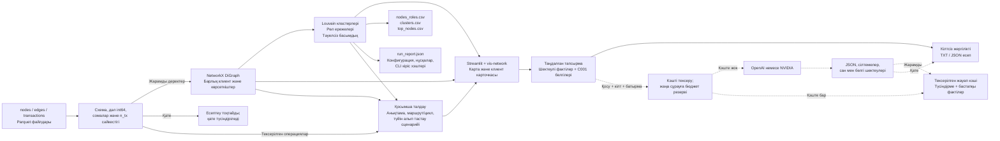

# MoneyMap архитектурасы

MoneyMap үш Parquet файлын жергілікті тексеріп, клиенттердің бағытталған байланыстарын, рөл болжамдарын, Louvain кластерлерін және тексеру басымдығын есептейді. Негізгі нәтижелер — ТЗ-дегі үш CSV және талдаушыға арналған веб-интерфейс. API кілті бұл есептеулерге қажет емес.

Қосымша жергілікті модульдер негізгі нәтиженің үстінен есептеледі:

- `network_insights.py`: бағытталған топаралық ақша ағындары, байланыстырушы түйіндер, бақылау шектеулері және бірдей клиент санымен алып тастау стратегиялары.
- `anomalies.py`: ұқсас сомалар, күндік белсенділік, бір күндегі жіберушілер және бір буындағы robust ауытқу; әр белгі сандық негізбен беріледі.
- `evaluation.py`: бастапқы үш кестенің нормаланған SHA-256 таңбасына байланған бөлек сарапшы белгілері; CSV импорт/экспорт, іріктеме сапасы және бағалау қамтылуы.
- `graph_questions.py`: қазақша/орысша қолдау бар сұрақты қауіпсіз, шектеулі тапсырмаға айналдырады. Мәтін код ретінде орындалмайды; бастапқы сұрақ провайдерге жіберілмейді.
- `extended_reports.py`: `--extended` немесе интерфейстегі ZIP арқылы 12 қосымша есеп; әдіс параметрлері, рөл конфигурациясы және хэштер қоса сақталады.

Сарапшы бағасы рөл ережелеріне автоматты түрде араластырылмайды. Бірдей деректі қайта есептеу белгілерді сақтайды; бастапқы дерек таңбасы ауысса белгі күйі жаңартылады. Аномалиялар мен құрылымдық сценарийлер негізгі рөл/басымдық ұпайларын жасырын өзгертпейді.

Бір бетке арналған [архитектура сызбасын браузерде ашуға](architecture.html), [SVG файлын жүктеуге](architecture.svg) немесе браузердің басып шығару мәзірімен PDF ретінде сақтауға болады. Бұл сызба `version_1` жаңартуындағы негізгі және AI ағынын көрсетеді; жергілікті «Қосымша талдау» тармағы төмендегі Mermaid сызбасы мен кестеде толықтырылған. HTML-де сыртқы қаріп, скрипт немесе желіден жүктелетін ресурс жоқ.




## Есептеу бөліктері

| Бөлік | Негізгі файлдар | Жауапкершілігі |
|---|---|---|
| Деректерді қабылдау | `data.py` | Схеманы, идентификатор дәлдігін, түйін сілтемелерін, сомалар мен операциялар сәйкестігін тексеру. Қате деректі үнсіз түзетпеу |
| Бағытталған граф | `graph.py` | Барлық түйінді, оқшауларды да сақтау; кіріс/шығыс, бірегей көршілер, PageRank, аралық орталықтық, seed-тен жету және күндік белгілерді есептеу |
| Рөл және кезек | `roles.py`, `config/roles.json` | Louvain үшін бағытталмаған салмақты проекция құру; рөл ережелерін және тәуелсіз басымдық ұпайын қолдану |
| Нәтижелер | `reports.py`, `__main__.py` | ТЗ-дегі тұрақты схемалы үш CSV, есептеу әдісі мен конфигурациясы бар JSON, CLI арқылы қайталанатын есеп |
| Интерактивті талдау | `app.py`, `ui_*.py`, `graph_view.py`, `graph_component/` | Карта, іздеу, сүзгілер, толық клиент карточкасы және есептерді жүктеу |
| Қосымша талдау | `investigation.py`, `ui_investigation.py` | Жергілікті анықтама, дерек сұраулары, шектеулі маршрут/цикл іздеуі, басым түйіндерді алып тастау сценарийі; іздеу шектері интерфейсте көрінеді |
| Қосымша түсіндірме | `ai_facts.py`, `ai_response.py`, `ai_service.py` | Дәлелдер пакеті, жергілікті есеп, жауапты тексеру, тексерілген жауаптың кэші |
| API және шығын | `ai_settings.py`, `ai_provider.py`, `ai_budget.py` | Сервердегі кілт, таңдалған бір провайдер, шектеулі сұрау, тұрақты бюджет журналы |
| Орта және қабылдау | `setup.ps1`, `run.ps1`, `scripts/verify_submission.py`, `scripts/package_submission.py` | Python/тәуелділіктерді дайындау, бір командадан CSV, қайталанымдылықты тексеру және қабылданған нәтижелердің архиві |

Кластерлеуге арналған проекция негізгі графты алмастырмайды: ақша бағыты мен бастапқы байланыстар сақталады. Карта сүзгісі тек көрсетілімге әсер етеді; рөл, басымдық және клиент карточкасындағы көрсеткіштер толық бақыланған жиыннан алынады. Бірдей операция жолдары жойылмайды.

Python ішінде `gid` дәл int64/бүтін сан күйінде сақталады; браузерге мәтін ретінде беріледі. CSV-ді Excel-ге импорттағанда да `gid` бағанын мәтін ретінде таңдаңыз. Жіберушілер мен алушылар саны өзге бірегей клиенттерді есептейді. Өзіне аударымдар бұл санға кірмейді, бірақ графтан, сомадан, операция санынан және кластер айналымынан жойылмайды. Өзіне ғана аударымы бар клиент оқшау емес, рөлге дәлелі жеткіліксіз клиент ретінде сақталады.

CLI негізгі тізбекті браузерсіз орындайды:

```powershell
.\.venv\Scripts\python.exe -m moneymap run --data-dir data/case --out output/stage3
```

Windows-та ортаны тексеріп, сол CLI-ді бір командамен шақыруға болады: `powershell -ExecutionPolicy Bypass -File .\run.ps1 -DataDir data/case -Out output/stage3`. `setup.ps1` бар ортаны қайта қолданады, қажет болса Python жолын `-PythonPath`, бөлек ортаны `-VenvDir`, жергілікті пакеттерді `-Wheelhouse` арқылы қабылдайды. Нақты кейс файлдары Git құрамына кірмейді.

CLI есебіндегі `run_report.json` кіріс файлдарының SHA-256 хэштерін, конфигурацияны, қолданылған нұсқаларды және орындау уақытын тіркейді. Вебте жүктелетін есепте рөл конфигурациясы мен қорытынды бар; бастапқы файл хэштері мен толық орындалу метадеректері CLI есебіне тән.

## Қазіргі API күйі және деректер шекарасы

Қазіргі жұмыс режимі — **кілтсіз жергілікті режим**. Граф, рөлдер, карта және жергілікті аналитикалық есеп API шақырмай жұмыс істейді. API қосылу коды жасанды жауаптармен тексерілген; нақты кілтпен OpenAI/NVIDIA қолжетімділігі, тілдік модельдің жауап сапасы және нақты төлем әлі тексерілген жоқ.

API кейін қосылғанда пайдаланушы бір провайдерді таңдап, сұрау батырмасын басады. Сыртқа тек тапсырмаға қажет шектеулі қаржылық фактілер мен `C001` сияқты белгілер жіберіледі. Толық gid сәйкестік картасы, бастапқы Parquet файлдары және операциялар кестесі жіберілмейді. Қаржылық көрсеткіштердің өзі нақты дерек болып қалады.

Жауап кэші сұраудан бұрын тексеріледі. Кэште жоқ жауап үшін алдымен шығын резерві сақталады, содан кейін ғана провайдер шақырылады. Жауап схемасы, факт нөмірлері және мәтіндегі сан/белгі шектеулері тексеріледі. Қате болса жергілікті есеп қолжетімді; автоматты қайталау мен басқа провайдерге өздігінен ауысу жоқ. Мәтін мағынасының дұрыстығын талдаушы тексереді.

## Жергілікті сақтау және құпия мәндер

| Не сақталады | Қайда және қанша уақыт |
|---|---|
| Ұйымдастырушының бастапқы файлдары | Бастапқы файлдар өзгермейді; жобаға берілген жергілікті көшірмелер `data/` ішінде болуы мүмкін |
| Жүктелген деректер және есептер күйі | Streamlit серверінің ағымдағы сеанс жадында; жаңа дерек немесе қайта есептеу бұрынғы карта/қосымша талдау/AI күйін тазартады; жүктелген шикі файлдар автоматты сақталмайды |
| CLI нәтижелері | Таңдалған `output/` қалтасында пайдаланушы файлдарды басқарғанға дейін |
| Жүктелген CSV, JSON және TXT | Пайдаланушы браузерден сақтаған жерде; клиенттің толық gid мәндері болуы мүмкін |
| API кілті | Сервердегі `.env` не процесс ортасында; браузерге және шығын журналына шығарылмайды |
| API шығын журналы | `output/ai/usage.sqlite3`; қолданба қайта іске қосылса да сақталады. Тек провайдер, модель, уақыт, күй, токен және шығын есебі |
| AI жауап кэші | Ағымдағы браузер сеансына қатысты сервер жадында, ең көбі 30 нәтиже; жауап мәтіні журналға жазылмайды |

`.env`, `data/`, `output/`, `.streamlit/secrets.toml` және журнал файлдары `.gitignore` арқылы Git-тен шығарылған; `.env.example` тек бос кілттері бар үлгі ретінде беріледі. Кілт қолданба конфигурациясының мәтіндік көрсетіліміне енгізілмейді.

Веб сервер `127.0.0.1:8501` мекенжайына байланысады. Карта кітапханасы жергілікті ресурстардан жүктеледі; браузерге граф үшін сыртқы CDN қажет емес. Тәуелділіктер алдын ала орнатылып, деректер қолжетімді болғанда негізгі талдау мен жергілікті есеп сыртқы модель қызметіне тәуелді емес. API тармағын қосу үшін желі керек; толық оқшауланған ортадағы орнату бұл тұжырыммен расталмайды.

Seed кірісі мен 4-буындағы шығыс толық емес. Құрылымдық жол дәл сол қаражаттың хронологиялық қозғалысын дәлелдемейді. Рөл, кластер және басымдық — адамның әрі қарай тексеруіне арналған түсіндірілетін нәтижелер.

## Нәтиженің мағынасы

Рөл — ережеге негізделген тексеру гипотезасы. `role_score` калибрленген ықтималдық емес; `priority_score` бөлек есептеледі. Louvain кластері ортақ қылмыстық ниетті дәлелдемейді. Seed кірістері, төртінші буын және бақылау кезеңі толық емес болуы мүмкін; соңғы көрінген алушыны нақты соңғы бенефициар деп атауға болмайды.

Графтағы цикл мен бірнеше күнгі A→B→C аударымдары құрылымдық/уақыттық белгі береді. Олар бірдей ақша келесі аударымда қолданылғанын дәлелдемейді. Шектеулі іздеуде үлгі табылмауы бүкіл желіде ондай үлгі жоқ деген қорытынды бермейді. Топ-N клиентті алып тастау — бақыланған графтың математикалық моделі; адамдардың кейінгі бейімделуі оған кірмейді.

## Миллион түйінге өту

Бұл бөлім — іске асыру жоспары. Қазіргі нұсқаның миллион түйіндегі уақыт/жад өлшемі жоқ. Негізгі кедергілер: барлық кестені жадта ұстау, NetworkX объектілерінің көлемі, дәл betweenness, әр seed-тен жеке іздеу және толық графты браузерге беру.

Ұсынылатын өзгеріс реті:

1. **Кіріс:** Parquet-ті баған/бөлік бойынша оқу; операцияларды DuckDB немесе Polars арқылы агрегаттау. Түпнұсқа int64 идентификаторын сақтау, тексерулерді файлдар арасында да орындау.
2. **Граф:** ықшам CSR/CSC көрінісі және тұрақты `gid ↔ индекс` сәйкестігі; компоненттерді дербес өңдеу. `igraph`, NetworKit немесе басқа қозғалтқышты сол бір шағын эталонда салыстырып таңдау.
3. **Алгоритмдер:** белгіленген дәні бар жуық betweenness, пакеттелген seed қолжетімділігі, граф қозғалтқышындағы PageRank/кластерлеу. Дәл және жуық рөлдердің ауысуын, топ-N қиылысын және ұпай айырмасын өлшеу.
4. **Қызмет көрсету:** фондық тапсырма мен сақталған нәтижелер; кіріс хэші және конфигурация бойынша кэш. Интерфейске кластерлердің жиынтық графын, таңдалған клиенттің шектеулі айналасын және беттелген операцияларды беру.
5. **Қабылдау:** 10 мың, 100 мың және 1 миллион түйін; сирек/тығыз байланыс, оқшау түйін және үлкен компоненті бар деректер. Әр көлемде wall time, ең жоғары жад, файл көлемі, түйін/сома сақталуы, тұрақтылық және жуықтау қатесін жазу. Аппараттық талап пен уақыт кепілдігін тек осы өлшемдерден кейін жариялау.

Қайта іске қосу нұсқаулығы және формалды рөл критерийлері [README](../README.md) ішінде; көрсету сценарийі [DEMO.md](DEMO.md) ішінде.
