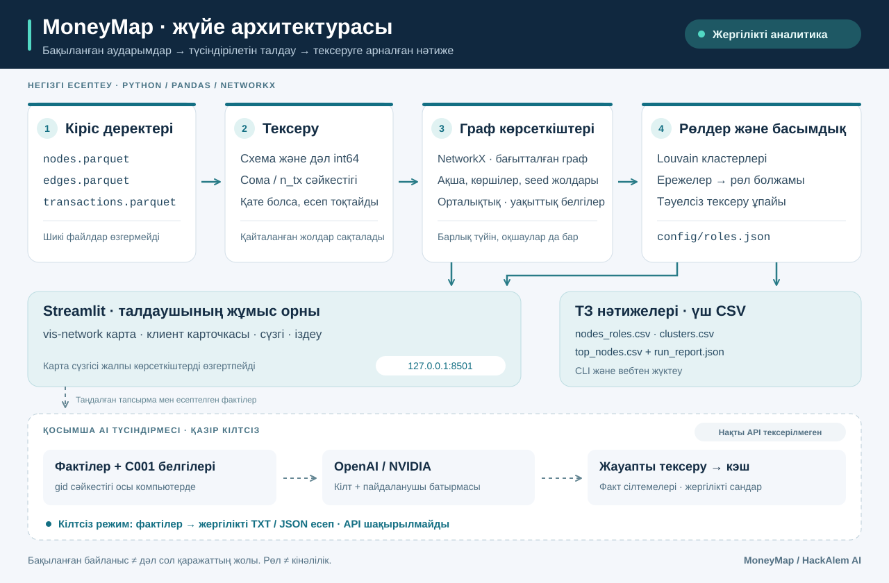
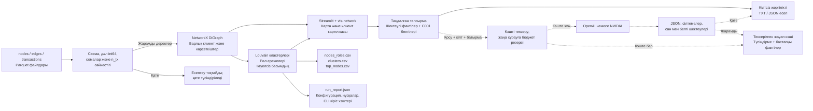

# MoneyMap архитектурасы

MoneyMap үш Parquet файлын жергілікті тексеріп, клиенттердің бағытталған байланыстарын, рөл болжамдарын, Louvain кластерлерін және тексеру басымдығын есептейді. Негізгі нәтижелер — ТЗ-дегі үш CSV және талдаушыға арналған веб-интерфейс. API кілті бұл есептеулерге қажет емес.

Бір бетке арналған [архитектура сызбасын браузерде ашуға](architecture.html), [SVG файлын жүктеуге](architecture.svg) немесе браузердің басып шығару мәзірімен PDF ретінде сақтауға болады. HTML-де сызба ішіне енгізілген: сыртқы қаріп, скрипт немесе желіден жүктелетін ресурс жоқ.





## Есептеу бөліктері

| Бөлік | Негізгі файлдар | Жауапкершілігі |
|---|---|---|
| Деректерді қабылдау | `data.py` | Схеманы, идентификатор дәлдігін, түйін сілтемелерін, сомалар мен операциялар сәйкестігін тексеру. Қате деректі үнсіз түзетпеу |
| Бағытталған граф | `graph.py` | Барлық түйінді, оқшауларды да сақтау; кіріс/шығыс, бірегей көршілер, PageRank, аралық орталықтық, seed-тен жету және күндік белгілерді есептеу |
| Рөл және кезек | `roles.py`, `config/roles.json` | Louvain үшін бағытталмаған салмақты проекция құру; рөл ережелерін және тәуелсіз басымдық ұпайын қолдану |
| Нәтижелер | `reports.py`, `__main__.py` | ТЗ-дегі тұрақты схемалы үш CSV, есептеу әдісі мен конфигурациясы бар JSON, CLI арқылы қайталанатын есеп |
| Интерактивті талдау | `app.py`, `ui_*.py`, `graph_view.py`, `graph_component/` | Карта, іздеу, сүзгілер, толық клиент карточкасы және есептерді жүктеу |
| Қосымша түсіндірме | `ai_facts.py`, `ai_response.py`, `ai_service.py` | Дәлелдер пакеті, жергілікті есеп, жауапты тексеру, тексерілген жауаптың кэші |
| API және шығын | `ai_settings.py`, `ai_provider.py`, `ai_budget.py` | Сервердегі кілт, таңдалған бір провайдер, шектеулі сұрау, тұрақты бюджет журналы |

Кластерлеуге арналған проекция негізгі графты алмастырмайды: ақша бағыты мен бастапқы байланыстар сақталады. Карта сүзгісі тек көрсетілімге әсер етеді; рөл, басымдық және клиент карточкасындағы көрсеткіштер толық бақыланған жиыннан алынады. Бірдей операция жолдары жойылмайды.

CLI негізгі тізбекті браузерсіз орындайды:

```powershell
.\.venv\Scripts\python.exe -m moneymap run --data-dir data/case --out output/stage3
```

CLI есебіндегі `run_report.json` кіріс файлдарының SHA-256 хэштерін, конфигурацияны, қолданылған нұсқаларды және орындау уақытын тіркейді. Вебте жүктелетін есепте рөл конфигурациясы мен қорытынды бар; бастапқы файл хэштері мен толық орындалу метадеректері CLI есебіне тән.

## Қазіргі API күйі және деректер шекарасы

Қазіргі жұмыс режимі — **кілтсіз жергілікті режим**. Граф, рөлдер, карта және жергілікті аналитикалық есеп API шақырмай жұмыс істейді. API қосылу коды жасанды жауаптармен тексерілген; нақты кілтпен OpenAI/NVIDIA қолжетімділігі, тілдік модельдің жауап сапасы және нақты төлем әлі тексерілген жоқ.

API кейін қосылғанда пайдаланушы бір провайдерді таңдап, сұрау батырмасын басады. Сыртқа тек тапсырмаға қажет шектеулі қаржылық фактілер мен `C001` сияқты белгілер жіберіледі. Толық gid сәйкестік картасы, бастапқы Parquet файлдары және операциялар кестесі жіберілмейді. Қаржылық көрсеткіштердің өзі нақты дерек болып қалады.

Жауап кэші сұраудан бұрын тексеріледі. Кэште жоқ жауап үшін алдымен шығын резерві сақталады, содан кейін ғана провайдер шақырылады. Жауап схемасы, факт нөмірлері және мәтіндегі сан/белгі шектеулері тексеріледі. Қате болса жергілікті есеп қолжетімді; автоматты қайталау мен басқа провайдерге өздігінен ауысу жоқ. Мәтін мағынасының дұрыстығын талдаушы тексереді.

## Жергілікті сақтау және құпия мәндер

| Не сақталады | Қайда және қанша уақыт |
|---|---|
| Ұйымдастырушының бастапқы файлдары | Бастапқы файлдар өзгермейді; жобаға берілген жергілікті көшірмелер `data/` ішінде болуы мүмкін |
| Жүктелген деректер және есептер күйі | Streamlit серверінің ағымдағы сеанс жадында; жаңа дерек немесе қайта есептеу бұрынғы карта/AI күйін тазартады |
| CLI нәтижелері | Таңдалған `output/` қалтасында пайдаланушы файлдарды басқарғанға дейін |
| Жүктелген CSV, JSON және TXT | Пайдаланушы браузерден сақтаған жерде; клиенттің толық gid мәндері болуы мүмкін |
| API кілті | Сервердегі `.env` не процесс ортасында; браузерге және шығын журналына шығарылмайды |
| API шығын журналы | `output/ai/usage.sqlite3`; қолданба қайта іске қосылса да сақталады. Тек провайдер, модель, уақыт, күй, токен және шығын есебі |
| AI жауап кэші | Ағымдағы браузер сеансына қатысты сервер жадында, ең көбі 30 нәтиже; жауап мәтіні журналға жазылмайды |

`.env`, `data/`, `output/`, `.streamlit/secrets.toml` және журнал файлдары `.gitignore` арқылы Git-тен шығарылған; `.env.example` тек бос кілттері бар үлгі ретінде беріледі. Кілт қолданба конфигурациясының мәтіндік көрсетіліміне енгізілмейді.

Веб сервер `127.0.0.1:8501` мекенжайына байланысады. Карта кітапханасы жергілікті ресурстардан жүктеледі; браузерге граф үшін сыртқы CDN қажет емес. Тәуелділіктер алдын ала орнатылып, деректер қолжетімді болғанда негізгі талдау мен жергілікті есеп сыртқы модель қызметіне тәуелді емес. API тармағын қосу үшін желі керек; толық оқшауланған ортадағы орнату бұл тұжырыммен расталмайды.

Seed кірісі мен 4-буындағы шығыс толық емес. Құрылымдық жол дәл сол қаражаттың хронологиялық қозғалысын дәлелдемейді. Рөл, кластер және басымдық — адамның әрі қарай тексеруіне арналған түсіндірілетін нәтижелер.
