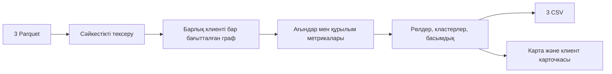

# HackAlem AI: кейсті толық түсіндіру және қорғауға дайындық

> **Жоба кейін жаңартылды.** Кейстің талаптары жөніндегі зерттеу сақталған; ағымдағы іске асыру мен соңғы тексеру: [түзетілген нұсқа](RELEASE_REVIEW_KK.md).

Зерттеу күні: 2026-09-23. Бұл есеп ұйымдастырушының сегіз беттік PDF құжаты, датасет README файлы, үш нақты Parquet файлы және starter папкасындағы үш файл негізінде жасалды. Қазіргі MoneyMap жобасы бөлек салыстырылды. Құжаттағы талаптар ұйымдастырушының талаптары ретінде берілді; ұсыныстар мен жобада қазір бар мүмкіндіктер олардан ажыратылды.

## 1. Қандай мәселені шешу керек?

Негізгі пайдаланушы — банктің AML талдаушысы, яғни күмәнді қаржылық байланыстарды зерттейтін маман. Кейс бойынша оған бастапқыда 81 клиент белгілі. Ол осы клиенттерден шыққан ақша қайда кететінін, қай шотта жиналатынын, кім арқылы әрі қарай өтетінін және бірнеше тармақты байланыстыратын түйіндерді анықтағысы келеді.

Қазіргі қиындық — бұл тізбектерді қолмен қарау ұзаққа созылады. Тапсырманың басты сұрағы: **«2 248 клиенттің қайсысын бірінші тексеру керек және неге?»**

Сондықтан нәтиже — деректерді есептейтін пайплайн және оларды зерттейтін интерфейс. Әр клиенттің ықтимал рөлі, маңызды байланыстары, кластері және тексеру басымдығы түсіндірілген болуы тиіс. Шешім қосымша тексеруге арналған гипотеза береді; клиенттің кінәсін анықтамайды.

PDF кейсті 5 сағаттық командалық жұмыс деп сипаттайды. Ұйымдастырушылардың бағалау логикасы — критерийдің негізділігі және іске жарамдылық. Бір ғана «дұрыс» рөлдер тізімі жоқ.

## 2. Берілген төрт материалдың қызметі

| Материал | Қызметі |
|---|---|
| HackAlem AI PDF | Мәселе, пайдаланушы, міндетті нәтиже, шектеулер, бағалау |
| Downloads/README.md | Датасет қалай жиналғаны және бағандардың мағынасы |
| data (1)/data/ | Есептеуге берілген нақты үш Parquet кестесі |
| starter (1)/starter/ | Деректі оқу, граф құру, бастапқы метрикалар және бос CSV үлгілері |

`__MACOSX` — архивтің техникалық қосымшасы; талдауға арналған негізгі дерек емес. Нақты кіріс жолы: `C:/Users/USER/Downloads/data (1)/data/`. Starter жолы: `C:/Users/USER/Downloads/starter (1)/starter/`.

Parquet — кестелік деректі сақтайтын файл пішімі. Оны деректер базасына алдын ала көшіру міндетті емес; бұл көлемде Python арқылы жергілікті оқуға болады.

### nodes.parquet

Бір жол — бір клиент.

| Баған | Мағынасы |
|---|---|
| gid | Клиенттің жасырындандырылған int64 идентификаторы |
| depth | Бастапқы клиенттерден неше қадамда алғаш табылды: 0–4 |
| is_seed | Бастапқы 81 клиенттің бірі ме |

### edges.parquet

Бір жол — бірегей жіберуші → алушы жұбының айлық жиынтығы.

| Баған | Мағынасы |
|---|---|
| src | Ақшаны жіберген клиент |
| dst | Ақшаны алған клиент |
| sum_kzt | Осы жұп арасындағы айлық аударымдар қосындысы |
| n_tx | Осы жұптағы жеке аударым саны |
| depth | Байланыс іздеудің қай қадамында табылды: 1–4 |

### transactions.parquet

Бір жол — жеке аударым. Бағандары: `src`, `dst`, `date`, `sum_kzt`. `date` күнді ғана береді; сағат пен минут жоқ.

Мысалы, бір клиент екіншісіне бір айда үш рет аударса, transactions ішінде үш жол, edges ішінде бір жол болады. Бағытталған графта клиент — түйін, ақша аударымы — бағыты бар байланыс.

## 3. Нақты файлдардан қайта тексерілген сандар

| Көрсеткіш | Нәтиже |
|---|---:|
| Клиенттер | 2 248 |
| Бірегей бағытталған жұптар | 3 119 |
| Жеке аударым жолдары | 4 840 |
| Бастапқы клиенттер | 81 |
| Кезең | 2026-07-01 — 2026-07-31 |
| Жазылған аударымдар қосындысы | 365 890 012,01 ₸ |
| Ең кіші / медианалық / ең үлкен аударым | 5 000 / 30 000 / 3 000 000 ₸ |
| 0 / 1 / 2 / 3 / 4 буындағы клиенттер | 81 / 472 / 462 / 789 / 444 |
| Байланысы жоқ клиенттер | 19, барлығы seed |
| Шығыс аударымы жоқ seed | 31, оның 12-сі тек алушы |
| Барлық клиент қосылғандағы әлсіз байланысқан компоненттер | 35 |
| Байланысы бар клиенттермен ғана есептегендегі компоненттер | 16 |
| Екі ең үлкен компонент | 1 877 және 270 клиент |
| Бір түйіндегі ең көп бірегей жіберуші / алушы | 24 / 116 |

Міндетті бағандарда бос мән жоқ. Қайталанған gid, қайталанған агрегатталған жұп, өзіне аударым және nodes ішінде жоқ аударым қатысушысы табылмады. Жеке аударымдарды жұп бойынша қосқанда edges сомалары 0,01 ₸ дәлдікпен, саны дәл сәйкес келеді. Ең кіші сома 5 000 ₸ шегіне сай.

PDF-тегі 16 компонент пен біздің 35 санымыз қайшылық емес: 19 оқшау клиентті қоссақ, 16 + 19 = 35. Сол сияқты ең үлкен компоненттен тыс барлық клиент саны 371; тек байланысы барларын алсақ 352.

PDF-тегі 354 «шығысы кірісінен көп» клиент — кірісі оң клиенттер ішіндегі сан. Кірісі нөл 23 клиентті қоссақ, жалпы саны 377 болады. Толық емес бақылау жағдайында бұл айырма өздігінен аномалияны дәлелдемейді.

365,89 млн ₸ — желідегі аударымдар жиынтығы. Бір қаражат бірнеше қадамда қайта санала алады; оны бірегей ақша көлемі немесе дәлелденген заңсыз табыс деп атауға болмайды.

## 4. Комиссия міндетті түрде күтетін нәтиже

PDF-тің 4–5-беттеріндегі бес must-have:

| Міндетті талап | Қалай көрсетіледі/тексеріледі |
|---|---|
| Қайталанатын пайплайн | README-дегі бір команданың орындалуы үш CSV-ді автоматты жасайды |
| Әр клиентке рөл және ұпай | 2 248 жолдың бәрінде рөл, role_score, cluster_id, priority_score және evidence бар |
| Түсіндірілетін рөлдер | Комиссия атаған үш gid бойынша ереже мен нақты сандарды бір минут ішінде түсіндіру |
| Кластеризация | Әр клиенттің кластері бар; әр кластердің мөлшері, seed саны, ішкі айналымы және гипотезасы есептелген |
| Тексеру кезегі және граф | Кемінде 20 клиенттің негізделген рейтингі; gid бойынша табылатын, ақша бағыты көрінетін схема |

Шикі Parquet-тен барлық CSV-ге дейінгі толық есептеу жергілікті ноутбукта 5 минуттан аспауы керек. Интерфейс веб, notebook немесе desktop болуы мүмкін. Онлайн банк ағыны талап етілмейді: бір реттік дайын деректер жиынын өңдеу жеткілікті.

Міндетті файлдардың схемасы:

```text
nodes_roles.csv
gid,role,role_score,cluster_id,priority_score,evidence

clusters.csv
cluster_id,n_nodes,n_seed,sum_kzt_internal,top_gids,hypothesis

top_nodes.csv
rank,gid,role,priority_score,why
```

`nodes_roles.csv`: дәл 2 248 клиент; ұпайлар 0–1; evidence бос емес әрі 200 таңбадан аспайды. `clusters.csv`: бір кластерге бір жол. `top_nodes.csv`: кемінде 20 жол, priority_score бойынша кему реті. Starter README қосымша бағандарға рұқсат береді; міндетті бағандарды сақтау қажет.

Сонымен бірге бастапқы код репозиторийі, толық README, «деректер → метрикалар → рөлдер → интерфейс» диаграммасы және 5 минуттық тірі демо міндетті. README іске қосуды, ережелер мен шектерді, нәтижелерді, шектеулерді және шамамен 1 млн түйінге өскенде тәсілдің қалай өзгеретінін түсіндіруі тиіс. Миллион түйінді нұсқаны іске асыру талап етілмейді.

## 5. Алты рөлдің мағынасы

| CSV мәні | Түсінікті мағынасы | Негіз бола алатын бақыланған белгі |
|---|---|---|
| consolidator | Ақша жинақтаушы кандидат | Бірнеше жіберушіден алады, көрінетін шығыс үлесі аз |
| transit | Транзиттік түйін кандидаты | Кіріс пен шығыс сомалары жақын, екі бағытта байланысы бар |
| distributor | Ақша таратушы кандидат | Көп түрлі алушыға жібереді |
| terminal | Осы үзіндідегі ықтимал соңғы алушы | Кірісі бар, көрінетін шығысы жоқ; шекаралық түйін бөлек қаралады |
| coordinator | Ықтимал үйлестіруші | Бірнеше бастапқы тармақты байланыстыратын құрылымдық белгілер |
| peripheral | Айқын рөл белгісі табылмаған | Басқа ережелерге сай келмейді немесе дерек жеткіліксіз |

Бұлар — ұйымдастырушы берген сөздік. Нақты сандық шектерді команда таңдап, негіздейді. Белгілі бір рөл санына жасанды түрде жету қажет емес. `peripheral` қауіпсіз клиент дегенді білдірмейді; `coordinator` ұйымдастырушы екенінің дәлелі емес.

`role_score` — таңдалған рөл ережесінің қаншалықты қолдау тапқанын сипаттайтын ұпай. `priority_score` — клиентті тексеру кезегіндегі орны. Екеуі әртүрлі сұраққа жауап береді. Деректе ground truth жоқ болғандықтан, бұл ұпайларды калибрленген қылмыстық ықтималдық ретінде ұсынуға болмайды.

Түсіндірме форматының мысалы, нақты клиент туралы қорытынды емес: «11 жіберушіден 4,2 млн ₸ алды; көрінетін шығыс үлесі 3%; жинақталу белгісі бар». «Модель осылай шешті» деген жауап жеткіліксіз.

## 6. Ескерілмесе қорытындыны бұзатын шектеулер

1. **4-буын — бақылаудың шекарасы.** Нақты 444 клиенттің ешқайсысында шығыс байланысы жоқ. Бұл оларда ақша қалды дегенді білдірмейді: әрі қарай іздеу жүргізілмеген. PDF шекара артефактын терең өңдеуді қосымша мүмкіндікке жатқызады, бірақ оны дерек сапасының шектеуі ретінде түсіндіруді бағалайды.
2. **Кіріс толық көрінбейді.** Граф белгілі seed клиенттерден шығыс аударымдарды іздеу арқылы жиналған. Әсіресе seed үшін «жібергені / алғаны» толық қаржылық қатынас емес. Қалған клиенттердің де сырттан алған ақшасы көрінбеуі мүмкін.
3. **Бір ай, бір банк, 5 000 ₸ шегі.** Басқа банктер, басқа айлар және шектен төмен аударымдар жоқ. Шектен төмен ұсақтауды осы дерекпен анықтадық деуге болмайды.
4. **Күн бар, уақыт жоқ.** Бір күн ішінде қай операция бұрын болғанын, «5 минутта өткізді» дегенді дәлелдеу мүмкін емес. A→B→C жолы айлық графта бар болуы сол ақшаның сол ретпен өткенін растамайды.
5. **19 оқшау клиент сақталуы керек.** Графты тек edges-тен құрса, олар түсіп қалады; nodes кестесіндегі барлық клиент алдын ала қосылады.
6. **Дайын дұрыс жауаптар жоқ.** Рөлдер, клиент атрибуттары, шот қалдықтары, операция мақсаты және қолма-қол шығару белгісі берілмеген. Accuracy/F1 көрсету үшін сыртқы шынайы белгі қажет; оны ойдан құрастыруға болмайды.
7. **97 бірдей көрінетін қосымша транзакция жолы бар.** Күн, жіберуші, алушы және сома бірдей болуы мүмкін. Transaction ID жоқ; бұларды автоматты жою edges сомасы мен n_tx-ті бұзады.
8. **gid өте үлкен.** Барлық 2 248 ID JavaScript қауіпсіз бүтін сан шегінен жоғары. Нақты тексеруде int64→float64→int64 айналымы әр ID-ді өзгерткен. Python ішінде int64 не жол; браузер/JSON ішінде жол; Excel-ге импорттағанда мәтін керек.

PDF сыртқы дерекпен клиенттерді толықтыруға, кодқа «дұрыс gid» тізімдерін тігіп қоюға, түсіндірілмейтін рөлдерге және негізгі жұмысты міндетті ақылы сервиске/GPU-ға тәуелді етуге тыйым салады. Деректер хакатон аясында пайдалануға берілген. Қорытындылар тек тексерілетін гипотеза ретінде жазылады.

## 7. Starter қаншалықты дайын?

Starter барлық үш Parquet-ті оқиды, бағытталған NetworkX графын құрады, бірегей жіберуші/алушы санын, кіріс/шығыс сомасын, операция санын, PageRank, out/in қатынасын және шекара белгісін есептейді.

Бірақ оның nodes_roles.csv файлында role мен evidence бос, ұпайлар нөл, cluster_id=-1. clusters.csv және top_nodes.csv ішінде тек баған атаулары бар. Рөлдер, кластеризация, басымдық, түсіндірме және интерфейс әлі жасалмаған.

Екі нақты кодтық олқылық табылды:

- `sanity_check` транзакциялардың жұп бойынша сомасы мен санын есептейді, бірақ оларды edges мәндерімен салыстырмайды; тек жұптардың бар-жоғын салыстырады.
- Граф edges арқылы ғана құрылады. Сондықтан 19 оқшау клиент граф объектісіне кірмейді, бірақ бастапқы nodes кестесімен біріктірілген CSV-де қалады.

Starter-дегі Louvain, betweenness, HITS немесе циклдерді іздеу туралы мәтін — ұсыныс, дайын функция емес. requirements.txt негізгі pandas, pyarrow, networkx, numpy пакеттерін береді. Жеке нейрондық модель үйрету міндетті емес.

## 8. Комиссияға ыңғайлы өнім қандай болуы керек?

Төмендегі экрандарға бөлу — ұсыныс; PDF нақты бет санын міндеттемейді.

| Экран | Аналитик не істейді |
|---|---|
| Деректер және жалпы шолу | Үш файлды ашады, көлемін, кезеңін, тексеру нәтижесін және бақылау шектеулерін көреді |
| Тексеру кезегі | Топ-20/30 клиентті рөлі, ұпайы және нақты негіздемесімен қарайды |
| Желі картасы | gid іздейді, бағыттарды көреді, рөл/кластер бойынша сүзеді, 1–2 қадамдық айналаны ашады |
| Клиент карточкасы | Кіріс/шығыс, көршілер, негізгі рөл ережесі, транзакциялар, seed-пен байланыс және белгісіздікті тексереді |
| Кластерлер және экспорт | Топтың құрамын, ішкі айналымын, гипотезасын және үш CSV-ді алады |

Бүкіл 2 248 түйінді бір экранға сыйғызу тек жалпы шолуға жарайды. Комиссия атаған нақты клиенттің айналасын ашып, оның неге осы рөлге түскенін көрсету әлдеқайда түсінікті.

Ұсынылатын негізгі есептеу реті:



Кластер — өзара байланысы тығыз топ; әлсіз байланысқан компонент — бағытты елемегенде бір-біріне жолы бар тұтас бөлік. Бір компонент бірнеше кластерге бөлінуі мүмкін. Екеуін бір ұғым деп түсіндіруге болмайды.

## 9. Қосымша ұпай үшін не пайдалы?

PDF қосымша ретінде уақыттық 1–2 күндік паттерндерді, ортақ алушыларды, қайталанатын маршруттар мен циклдерді, салыстырмалы аномалияларды, топ-N түйінді алып тастағандағы өзгерісті, AI көмекшіні, автоматты карточканы және жетіспейтін дерекке келесі сұрауды атайды.

Осы дерек пен уақыт шегіне сүйенген ұсыныс: алдымен бес міндетті талап, содан кейін шекара мен дерек толықтығын анық көрсету, клиент карточкасы және уақыттық сипаттамалар. Соңынан AI қосуға болады.

AI көмекші негізгі есептелген фактілерді түсіндіріп, gid-терге сілтеме берсе пайдалы. Ол есептеу дәлелін алмастырмайды. Негізгі рөлдер, кластерлер және үш CSV интернетсіз орындалуы тиіс. LLM API қолжетімсіз болғанда да тірі демо жалғасуы керек.

AI міндетті must-have тізімінде жоқ; техникалық бағалауда оның нақты қолданылуы ескерілуі мүмкін. Сондықтан «чат қосылды» дегеннен гөрі оның аналитикке қандай нақты жұмысты жеңілдететінін көрсету керек.

## 10. Қазіргі жұмыс папкасындағы MoneyMap жағдайы

`D:/OSPanel/domains/hack-bfb7d63d-codeai` ішінде starter-ден бөлек дамытылған MoneyMap жобасы бар. Осы зерттеуде оның қолданба коды өзгертілген жоқ.

Кодта анықталған мүмкіндіктер: Streamlit интерфейсі, дерек валидаторы, толық граф, метрикалар, алты рөл, салмақталған Louvain, рөлден тәуелсіз басымдық, үш CSV, gid іздеуі бар карта, клиент карточкасы, бес көмекші тапсырма және жергілікті анықтамалар.

Нақты деректердің бастапқы Downloads жолынан пайплайн **осы зерттеуде екі рет** қайта орындалды:

| Қайта тексерілген нәтиже | Мән |
|---|---:|
| Қабылдау тексеруі | PASS |
| Клиенттер | 2 248 |
| Louvain кластерлері | 91 |
| Тексеру кезегіндегі клиенттер | 30 |
| evidence ең үлкен ұзындығы | 133 таңба |
| 1-іске қосу, Parquet → CSV | 1,632474 секунд |
| 2-іске қосу, Parquet → CSV | 1,661069 секунд |
| Толық subprocess уақыты | 2,319 және 2,305 секунд |
| Екі рет шыққан CSV-лер | Байт бойынша бірдей |
| Бастапқы Parquet хэштері | Өзгермеген |
| Python желі API шақырулары | Тексеру кезінде бұғатталған; әрекет тіркелмеген |

Бұл уақыт осы компьютерде, дайын орнатылған ортада өлшенді; тәуелділіктерді жаңа компьютерге орнату уақыты кірмейді. Тексеру Python socket/DNS шақыруларын шектейді; бүкіл операциялық жүйені желіден ажырату сынағы емес.

Жаңа есептер: `output/case-research-20260923/results/`. Қабылдау дәлелі: `acceptance_report.json`. Қайталама есеп: `output/case-research-20260923/verification-repeat/`.

Әдепкі эвристиканың рөлдері: coordinator — 31, distributor — 37, consolidator — 22, transit — 69, terminal — 1 071, peripheral — 1 018. Бұл сандар — модель ережелерінің нәтижесі; расталған қылмыстық рөлдер емес. 91 кластер саны да «91 қылмыстық топ» деген мағына бермейді. PDF-тегі бірнеше seed бар сегіз қауым туралы ескерту жалпы кластер саны сегіз болуы керек деген талап емес.

Қазіргі шектердің мысалдары: distributor үшін ≥10 алушы; consolidator үшін ≥5 жіберуші және жарамды көрінетін out/in≤0,3; transit үшін 0,8≤out/in≤1,2. Координатор ережесі кіріс/шығыс байланыстарын, бірнеше seed-тен жетуді және betweenness көрсеткішін бірге қолданады. Ережелер реті мен ұпай формулалары docs/STAGE3.md және config/roles.json ішінде бар.

Топтағы нақты мысал: `gid=100000008686313100` ағымдағы ережемен coordinator кандидаты, priority_score≈0,8833. Көрінетін кірісі 1 912 716 ₸, тікелей жіберушісі 6, оған бағытталған жолмен жететін seed саны 7. Соңғысы жеті тікелей жіберуші деген сөз емес. Рейтинг себебі мен рөл себебін карточкадан бөлек көрсету керек.

Осы аудитте толық браузерлік демо, жаңа машинадағы орнату және тірі LLM API қайта сыналған жоқ. Бұрынғы құжаттарда 260 тест пен offline тексерулер туралы жазба бар; оларды осы жолы қайта орындалған сынақ ретінде ұсынбау керек.

Кодтағы OpenAI/NVIDIA адаптерлері мен жергілікті шаблондық анықтама бар. Жергілікті мәтін — тірі LLM жауабы емес; нақты API жұмысы құжаттар бойынша әлі расталмаған. Көмекші бес алдын ала анықталған тапсырманы орындайды, еркін әрекет ететін агент емес. Уақыттық сипаттамалар көрсетіледі, бірақ негізгі transit ережесі мен priority формуласының уақытты пайдаланып тұрғанын мәлімдеуге болмайды.

Тапсыру ZIP-тері бар. Негізгі архивтегі 74 мазмұн файлы manifest хэштерімен және салыстырылған қазіргі жоба файлдарымен сәйкес. Бастапқы Parquet архивке кірмеген. Offline архив Windows x64/Python 3.14 пакеттеріне арналған; Python-ның өзін және нақты деректерді бірге алып жүру мәселесін бөлек дайындау қажет.

## 11. Қорғауға апаратын жинақ пен 5 минуттық демо

Алып баратын жинақ: код репозиторийі/ZIP, іске қосу README, үш бастапқы Parquet, үш дайын CSV, бір архитектура диаграммасы, жұмыс істейтін жергілікті орта, 2–3 түсіндірілетін клиент мысалы. API қолданылса, негізгі демо кілтсіз де жүре алуы керек.

| Уақыт | Көрсетілетін әрекет |
|---|---|
| 0:00–0:40 | Пайдаланушы мәселесі: 81 бастапқы клиенттен 2 248 клиентке дейінгі тексеру кезегін түсіндіру |
| 0:40–1:20 | Нақты үш файлдан есептеуді іске қосу, саны мен уақыты, үш CSV |
| 1:20–2:10 | Топтағы бір клиенттің нақты ережесін, ұпай үлестерін және ақша ағындарын көрсету |
| 2:10–3:00 | Екінші клиентті картадан gid бойынша табу, оның 1–2 қадамдық байланысын ашу |
| 3:00–3:40 | Үшінші мысал: 4-буын клиенті не оқшау seed; неге қорытынды шектелгенін түсіндіру |
| 3:40–4:20 | Бір кластердің құрамын, ішкі айналымын және гипотезасын көрсету |
| 4:20–5:00 | Нәтиже экспорты, дерек шектеулері және келесі тексеруге қажет деректер |

Қорғауға дайындықтың нақты сынағы: команда мүшесі сіз алдын ала жаттамаған үш gid атасын. Әрқайсысын картадан тауып, рөл ережесін және нақты мәндерін бір минутта түсіндіре алуыңыз керек. Қосымша өз бетіңізше таңдалған gid-ге ғана тәуелді демомен шектелмеңіз.

Жиі қойылатын сұрақтарға дайын жауаптар:

- «Неге осы рөл?» — формалды шарт, нақты көрсеткіштер және шектеу.
- «Неге ол бірінші?» — priority формуласына ең көп үлес қосқан белгілер.
- «Неге 444 соңғы түйіннің бәрі terminal емес?» — бақылау төрт қадамда тоқтаған.
- «Accuracy қанша?» — берілген деректе шынайы рөл белгісі жоқ; құрылымдық дұрыстық, түсіндірмелер және қайталанушылық тексерілген.
- «AI қай жерде?» — нақты есептелген фактілерді түсіндіруде; қай режимнің жергілікті, қайсысының API екенін ашық көрсету.
- «Интернет жоқ болса?» — негізгі жергілікті граф, есептеу және CSV жұмыс істейді; бұл жағдайды демо алдында толық сынау.
- «1 млн түйінге қалай өседі?» — қазір тек жоспар: агрегаттауды бөлу, ауыр орталықтықты жуықтау, тиімді граф қозғалтқышы, интерфейске тек таңдалған маңайды беру; мұндай көлем сыналды деп айтпау.

## 12. Бағалау және жұмыс басымдығы

PDF-тің 8-бетіндегі ресми кесте:

| Критерий | Ұпай |
|---|---:|
| Тапсырмаға сәйкестік және жұмыс істеуі | 25 |
| Техникалық іске асыру | 25 |
| README және қайта іске қосылуы | 25 |
| Құндылығы және қолдануға жарамдылығы | 15 |
| Даму әлеуеті және тәсілдің ерекшелігі | 10 |
| Барлығы | 100 |

Осы кестеден шығатын ұсыныс: міндетті сценарий мен қайта іске қосылуды бірінші бекіту; кейін рөл түсіндірмелері мен дерек шектеулерін жақсарту; содан кейін карта ыңғайлылығы және бір пайдалы қосымша мүмкіндік. README жеке 25 ұпай болғандықтан, орнату мен іске қосу нұсқаулығын соңына қалдырмау керек.

Қазіргі MoneyMap үшін келесі ең пайдалы жұмыс — жаңа мүмкіндік санын арттырудан бұрын басқа ортада орнату, толық бес минуттық браузерлік демоны қайталау, үш еркін gid-ді тексеру, нақты деректерді жеке дайындау және AI туралы мәлімдемелерді нақты жұмыс істейтін режимге сәйкестендіру.

## 13. Қазіргі жобаны іске қосу

Осы компьютерде дайын виртуалды орта бар. PowerShell:

```powershell
cd D:\OSPanel\domains\hack-bfb7d63d-codeai
powershell -ExecutionPolicy Bypass -File .\start.ps1
```

Браузер: `http://127.0.0.1:8501`. Терминал сервер жұмыс істеп тұрғанша ашық тұрады. Бұл зерттеу барысында сервер қайта іске қосылған жоқ.

Тек есептеу және үш CSV алу:

```powershell
.\.venv\Scripts\python.exe -m moneymap run --data-dir "C:\Users\USER\Downloads\data (1)\data" --out output/my-run
```

Жаңа компьютерде setup.ps1, деректердің орналасуы және offline пакеттердің сәйкестігі туралы негізгі README мен docs/STAGE6.md нұсқауларын пайдалану керек.

## Дереккөздер мен дәлелдер

- Ұйымдастырушы PDF: `C:/Users/USER/Downloads/HackAlem AI_ Граф денег_ восстановление финансовой структуры организованной группы по транзакционной сети.pdf` — барлық 8 бет мәтінмен және суретпен қаралды.
- Датасет сипаттамасы: `C:/Users/USER/Downloads/README.md`.
- Нақты кіріс: `C:/Users/USER/Downloads/data (1)/data/`.
- Starter: `C:/Users/USER/Downloads/starter (1)/starter/`.
- Қазіргі жоба: README.md, app.py, moneymap/, config/roles.json, docs/STAGE3.md, docs/DEMO.md, docs/JURY_QA.md, docs/STAGE6.md.
- Осы зерттеудің жаңа қабылдау есебі: `output/case-research-20260923/results/acceptance_report.json`.

Зерттеу сыртқы клиент атрибуттарын қоспады, бастапқы файлдарды өзгертпеді және ақылы API шақырмады. Жаңа өнім құрастырудың орнына берілген кейс, деректер және бұрыннан бар жобаның күйі тексеріліп, қорғауға қойылатын талаптар нақтыланды.
